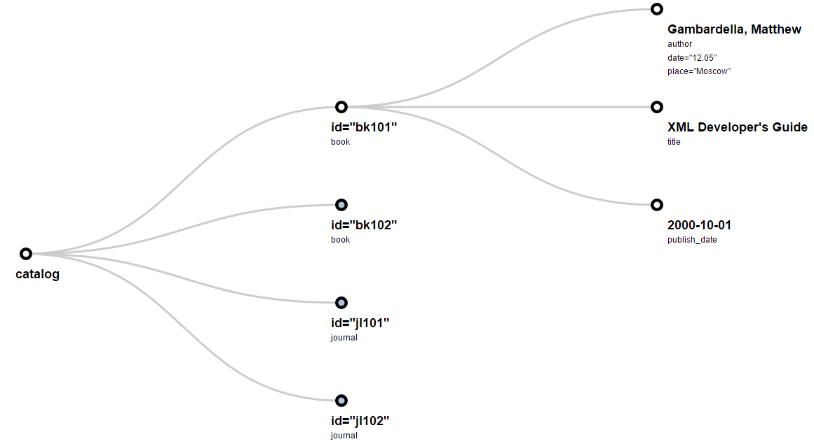
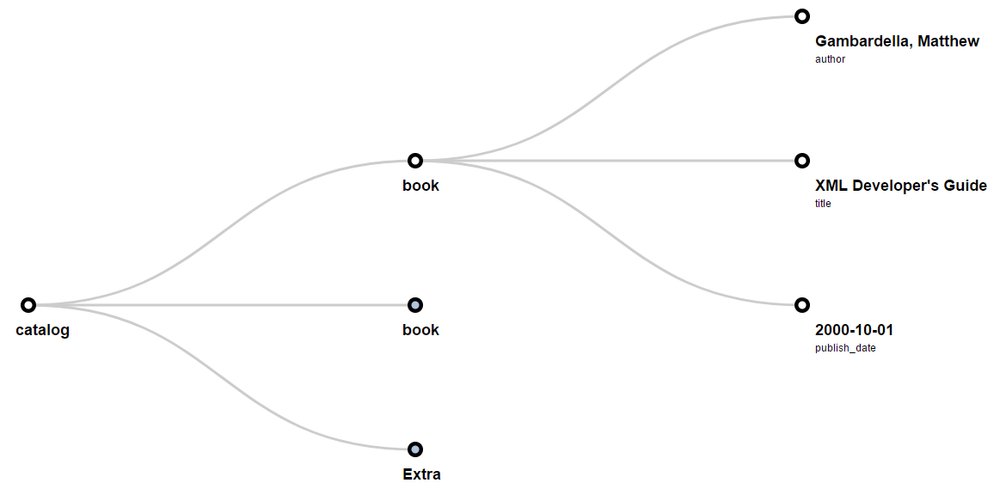

# [Xml2Tree](https://github.com/mmaltsev/XML2Tree)

Xml2Tree is a library for visualizing XML data in the browser as a tree using d3.js.

Demo: https://mmaltsev.github.io/Xml2Tree/

Docs: https://mmaltsev.github.io/Xml2Tree/docs/

## Install

#### Add link to the library:
```html
<script src="https://cdn.rawgit.com/mmaltsev/Xml2Tree/master/src/xml2tree.min.js"></script>
```

#### Create new div element:
```html
<div class="chart1"></div>
```

#### Call function:
```html
<script>
  xmltotree("chart1", "example/example.xml", [], false, false)
</script>
```

## Options

| Variable         | Type    | Description            |
| ----------------- | ------- | ---------------------- |
| elementId        | string  | id of div that contains tree. |
| filePath         | string  | Path to the XML file. |
| secondLevelNodes | array of strings   | List of nodes to show on second level of tree. Other will be contained in 'Extra'. If not specified - everything is shown. |
| isAttributes     | boolean | Whether to show all attributes of elements in XML or not. |
| isJSON           | boolean | Specified when input file is JSON. |


## Examples
You can find an XML file that is used below [here](example/example.xml).

#### 1 Example Code:
```html
<script>
  var elementId = 'chart1';
  var filePath = 'example/example.xml';
  var secondLevelNodes = [];
  var isAttributes = true;
  var isJSON = false;
		
  xml2tree(elementId, filePath, secondLevelNodes, isAttributes, isJSON);
</script>
```

#### 1 Example Result:


#### 2 Example Code:
```html
<script>
  var elementId = 'chart1';
  var filePath = 'example/example.xml';
  var secondLevelNodes = ['book'];
  var isAttributes = false;
  var isJSON = false;
		
  xml2tree(elementId, filePath, secondLevelNodes, isAttributes, isJSON);
</script>
```

#### 2 Example Result:


## License.
MIT License. Copyright (c) 2016-2017 Maxim Maltsev.
